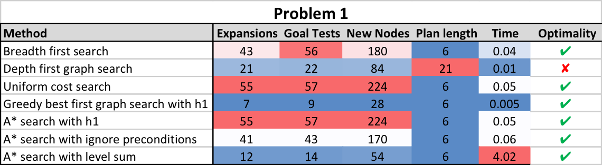
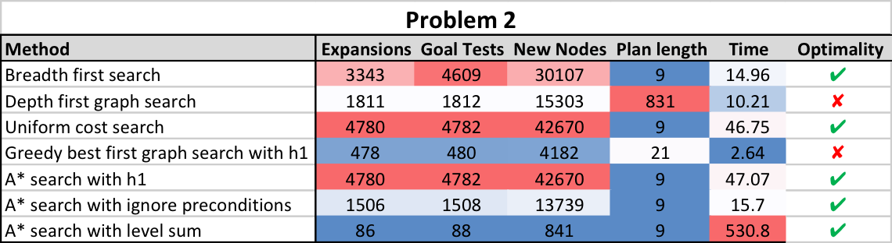
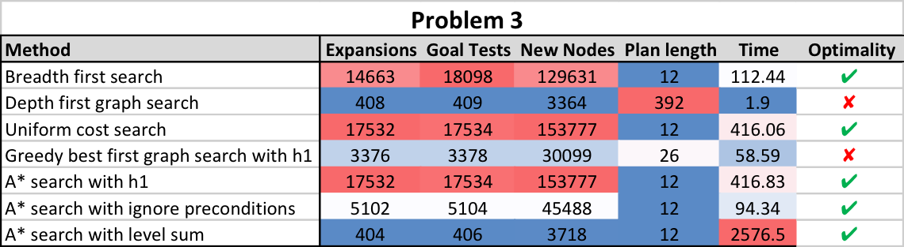
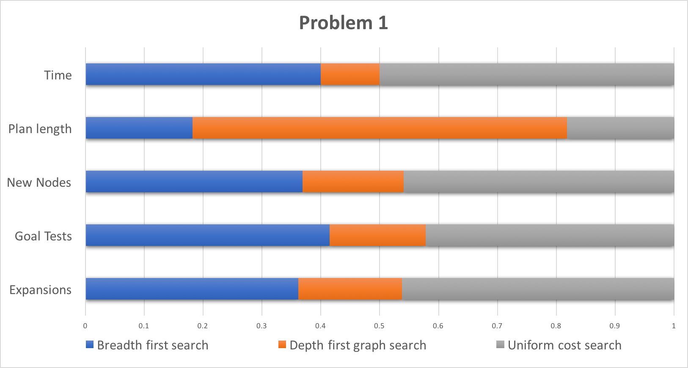
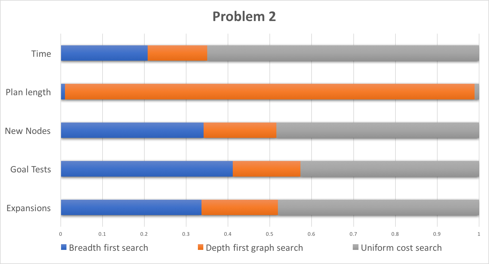
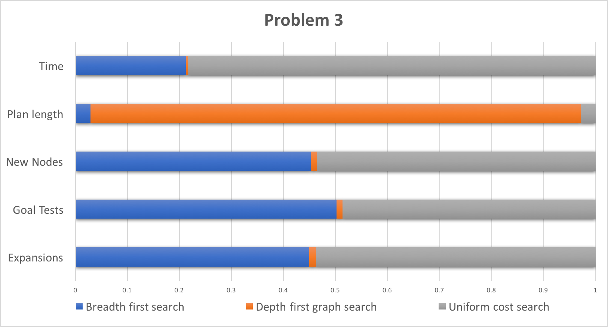
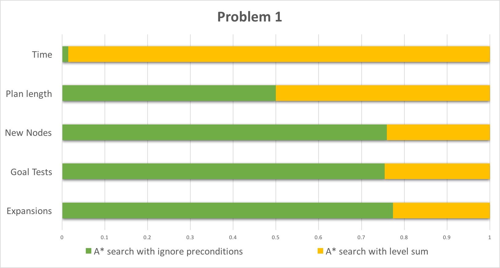
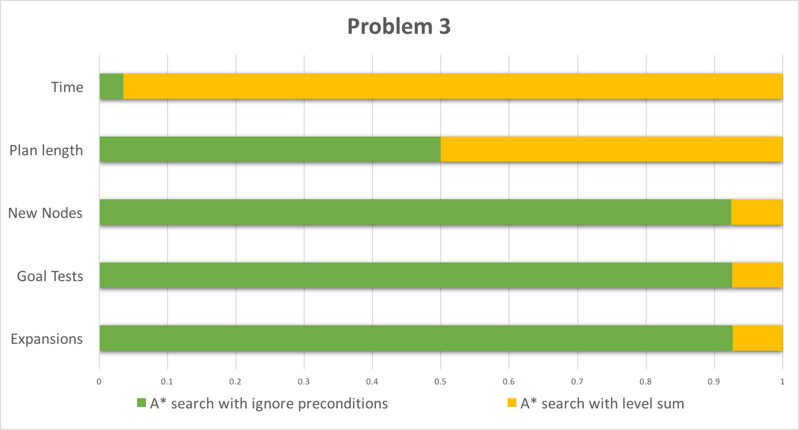

# Implement a Planning Search

## Synopsis

In this project I created a planning search agent to solve an air cargo logistics problem defined in classical PDDL (Planning Domain Definition Language). I implemented and compared different non-heuristic based progression search algorithms and two domain-independent heuristics to be used with the A* search algorithm.

## Problem description

The three problems that needed to be solved are shown below. They are defined in PDDL and are increasingly more complicated due to an increased number of variables (planes, cargo, and airports) and goal state requirements.

- Problem 1 initial state and goal:
```
Init(At(C1, SFO) ∧ At(C2, JFK) 
	∧ At(P1, SFO) ∧ At(P2, JFK) 
	∧ Cargo(C1) ∧ Cargo(C2) 
	∧ Plane(P1) ∧ Plane(P2)
	∧ Airport(JFK) ∧ Airport(SFO))
Goal(At(C1, JFK) ∧ At(C2, SFO))
```
- Problem 2 initial state and goal:
```
Init(At(C1, SFO) ∧ At(C2, JFK) ∧ At(C3, ATL) 
	∧ At(P1, SFO) ∧ At(P2, JFK) ∧ At(P3, ATL) 
	∧ Cargo(C1) ∧ Cargo(C2) ∧ Cargo(C3)
	∧ Plane(P1) ∧ Plane(P2) ∧ Plane(P3)
	∧ Airport(JFK) ∧ Airport(SFO) ∧ Airport(ATL))
Goal(At(C1, JFK) ∧ At(C2, SFO) ∧ At(C3, SFO))
```
- Problem 3 initial state and goal:
```
Init(At(C1, SFO) ∧ At(C2, JFK) ∧ At(C3, ATL) ∧ At(C4, ORD) 
	∧ At(P1, SFO) ∧ At(P2, JFK) 
	∧ Cargo(C1) ∧ Cargo(C2) ∧ Cargo(C3) ∧ Cargo(C4)
	∧ Plane(P1) ∧ Plane(P2)
	∧ Airport(JFK) ∧ Airport(SFO) ∧ Airport(ATL) ∧ Airport(ORD))
Goal(At(C1, JFK) ∧ At(C3, JFK) ∧ At(C2, SFO) ∧ At(C4, SFO))
```

## Solutions

The optimal solutions found by at least one of the search algorithms:

- Problem 1 solution in 6 steps:
```
Load(C1, P1, SFO)
Load(C2, P2, JFK)
Fly(P1, SFO, JFK)
Fly(P2, JFK, SFO)
Unload(C1, P1, JFK)
Unload(C2, P2, SFO)
```
- Problem 2 solution in 9 steps:
```
Load(C1, P1, SFO)
Fly(P1, SFO, JFK)
Load(C2, P2, JFK)
Fly(P2, JFK, SFO)
Load(C3, P3, ATL)
Fly(P3, ATL, SFO)
Unload(C1, P1, JFK)
Unload(C2, P2, SFO)
Unload(C3, P3, SFO)
```
- Problem 3 solution in 12 steps:
```
Load(C2, P2, JFK)
Fly(P2, JFK, ORD)
Load(C4, P2, ORD)
Fly(P2, ORD, SFO)
Load(C1, P1, SFO)
Fly(P1, SFO, ATL)
Load(C3, P1, ATL)
Fly(P1, ATL, JFK)
Unload(C1, P1, JFK)
Unload(C2, P2, SFO)
Unload(C3, P1, JFK)
Unload(C4, P2, SFO)
```

### Non-heuristic search
Tables 1-3 show the comparison between the following different non-heuristic search methods: breadth-first, depth-first, and uniform cost. The methods greedy best-first graph search with h1 and A* search with h1 also belong in this category as both of them are using the constant h1 heuristic, which, since it is constant, is not a true heuristic.
<p>

<em>Table 1: Problem 1</em>

<em>Table 2: Problem 2</em>

<em>Table 3: Problem 3</em>
</p>
The tables are colour coded with blue showing the best, white the intermediate and red the worst search method for the respective metric (#nodes expanded, #goal tests, #new nodes, plan length, and time). The optimality metric shows if the solution is optimal in length, that is, it consists of the minimum possible number of steps required to go from the initial to the goal state.

A first observation is that depth first and greedy best first generally perform best when it comes to all heuristics (apart from plan length) but deliver a non-optimal solution. While greedy best first delivers a plan with some additional unnecessary steps, the depth first solution is significantly longer than the ideal one. It can also be noted that A* search with a constant heuristic is identical to the uniform cost search.

For the following comparison, I ignore greedy best first due to non-optimality and A* with h1 since it is identical to the uniform cost method. I include depth first even though it's solution is non optimal, because it is by far the fastest algorithm to produce a solution. So in a case of negligible execution time, this method might still be useful. Figures 1-3 show the performance of the search methods relative to each other.
<p>

<em>Figure 1: Problem 1, non-heuristic methods</em>

<em>Figure 2: Problem 2, non-heuristic methods</em>

<em>Figure 3: Problem 3, non-heuristic methods</em>
</p>
Depth first search delivers non-optimal results but expands and evaluates the fewest nodes and comes to a solution in the least amount of time. The comparison between breadth first and uniform cost search is more interesting since both of them deliver an optimal result. Uniform cost takes longer and tends to create, expand and goal test more nodes. Going from the simple problem 1 to the more complicated problem 3, the difference becomes smaller though. This leads me to believe that as the problems get more complex, uniform cost search will start to create, expand and goal test fewer nodes than breadth first, although it might still require more time to come to a solution.

### Domain-independent heuristics
The previously shown tables 1-3 also include the results for the two heuristic based methods, A* search with ignore preconditions and A* search with level sum. Both methods deliver optimal solutions. The runtime of A* search with ignore preconditions is comparable to the non-heuristic methods, whereas the runtime for A* search with level sum is significantly higher. When it comes to node creation, expansion and goal testing though, A* search with level sum even beats the depth first search most of the time while A* search with ignore preconditions gives intermediate results.

Figures 4-6 show a relative comparison between the two heuristics methods.
<p>

<em>Figure 4: Problem 1, heuristic methods</em>

<em>Figure 5: Problem 2, heuristic methods</em>

<em>Figure 6: Problem 3, heuristic methods</em>
</p>
